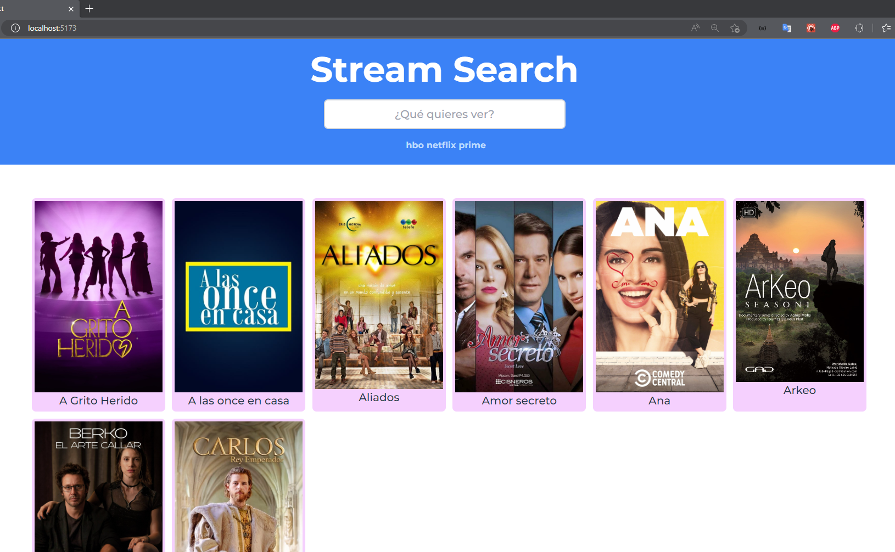

# CLASE DE REACT, PROYECTO DE BUSCADOR

El objetivo de está clase es poder profundizar en el uso de los Hooks de React, en este caso el useState y useEffect, para poder realizar una aplicación de búsqueda de series y películas de los servicios de streaming

## Fuente de datos

https://rapidapi.com/movie-of-the-night-movie-of-the-night-default/api/streaming-availability/

## Guía de estilos de Tailwind

https://flowbite.com/tools/tailwind-cheat-sheet/
